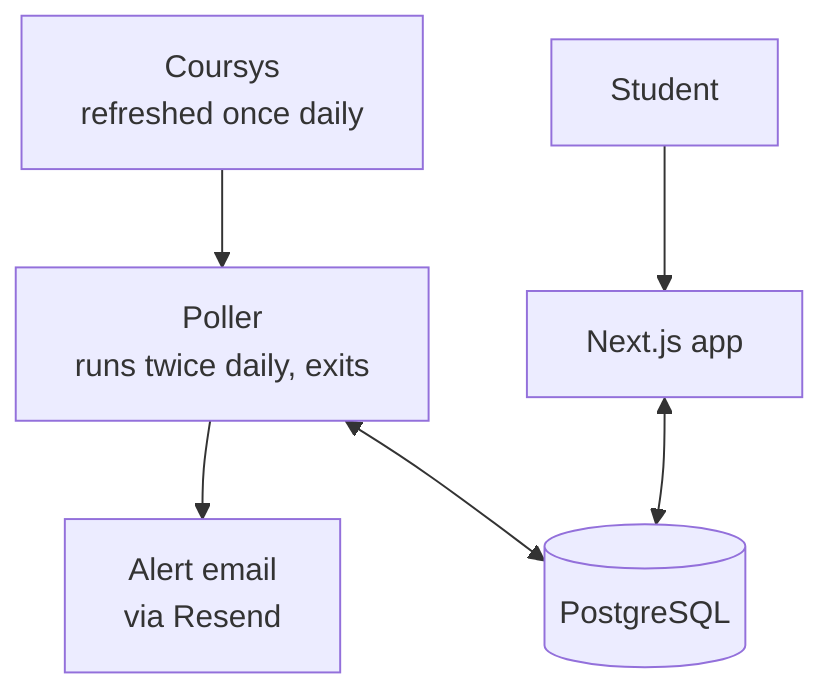

# CourseCatch
 
A shadow waitlist for SFU course enrollment. Watch as many course sections as you want and get an email when enrollment changes in your favour.
 
**[coursecatch.app](https://coursecatch.app)**
 
> Not affiliated with or endorsed by Simon Fraser University.
 
---
 
## The problem
 
goSFU limits students to **two waitlist positions** at a time. A typical student wants more — one required course with three viable sections, plus two electives, plus a backup. With only two slots, the rest means manually refreshing goSFU several times a day for a week, which is tedious, easy to forget, and biased toward whoever has the free time to keep checking.
 
CourseCatch watches the sections you can't waitlist and tells you when to go look.
 
## What it does
 
Pick a section, pick a condition, get one email when it's met:
 
| Condition | Fires when |
|---|---|
| **Room available** | `enrolled < capacity` **and** the waitlist is empty |
| **Waitlist below N** | `waitlist < N`, for a threshold you choose |
 
It does not enroll you, hold a seat, or touch goSFU. It reads publicly visible enrollment data and reports what it sees.
 
## Status
 
Built and deployed. The live window is SFU's Fall add/drop period, ending when waitlists freeze.
 
---
 
## How it works
 

 
Two lanes that never call each other, joined only by the database. The poller reads Coursys, writes the catalogue, and sends alerts. The web app writes watch rows. A broken interface doesn't stop alerts reaching existing users; a broken poller doesn't stop signups.
 
**The poller is the product.** The interface exists to populate one table.
 
### A run
 
1. **Date gate** — exit before any request if outside the add/drop window. Fails closed.
2. **Fetch** — one request for the whole term, ~2,963 rows.
3. **Validate** — row count must equal the response's `recordsFiltered`.
4. **Parse** — self-locating extraction; cells are found by shape, not position.
5. **Anomaly check** — abort before any write or send if the data looks wrong.
6. **Diff and upsert** — compare against stored state in memory, write only what changed (~40 rows).
7. **Evaluate** — one query returns the watches whose condition now holds.
8. **Dispatch** — send, log, delete the watch. One transaction per watch.
---
 
## Three problems worth knowing about
 
**Free seats don't mean you can enroll.** Sections routinely show empty seats *and* a waitlist — CMPT 213 D100 at 31/120 with someone waiting. That's the signature of capacity reserved for specific programs, or an enrollment package blocking entry to a lecture with room. So "room available" requires an empty waitlist as well as free seats, and no alert ever claims a seat is available to the recipient.
 
**A level check would fire on creation.** Both conditions test current state, so a section already satisfying one would alert the instant it was watched. An add-time guard refuses to create a watch whose condition already holds, and reports the current figures instead — which turns a useless alert into information delivered immediately. The guard tests the same predicate as the firing condition, so the two can't drift.
 
**Everything here fails silently.** If the upstream format changes and the parser starts reading every waitlist as zero, every watch fires at once — exhausting the send quota, marking the domain as a spam source, and destroying trust in a single cycle, inside a ten-day window. Anomaly checks run after parsing and before any write: parse failures, row-count deviation, a collapse in the number of sections carrying a waitlist, and a ceiling on what proportion of watches may fire in one run. On breach the run aborts, emails the operator, and writes nothing.
 
---
 
## Stack
 
| Component | Choice |
|---|---|
| Poller | Python, scheduled on Render (two cron jobs) |
| Database & auth | Supabase (PostgreSQL, RLS, email OTP) |
| Web | Next.js App Router, TypeScript, Tailwind, shadcn/ui, on Vercel |
| Mail | Resend, from a dedicated sending subdomain |
| Data source | Coursys public course browse endpoint |
 
Operating cost at launch scale: the domain.
 
---
 
## Repository
 
```
poller/          Python — fetch, parse, evaluate, dispatch
  SQL/           queries read at runtime
web/             Next.js app
  app/           routes and server actions
  components/    UI
  lib/supabase/  browser, server, and proxy clients
migrations/      schema and migrations
```
 
---
 
## Running locally
 
### Poller
 
```bash
cd poller
python -m venv venv && source venv/bin/activate
pip install -r requirements.txt
python script.py
```
 
`.env`:
 
```
DATABASE_URL=          # Supabase pooler connection (port 6543)
COURSYS_ENDPOINT=      # base browse URL
SEMESTER_CODE=1267     # Fall 2026
WINDOW_CLOSE=2026-09-18
RESEND_API_KEY=
MY_EMAIL=              # operator contact, also used in the User-Agent
```
 
### Web
 
```bash
cd web
npm install
npm run dev
```
 
`.env.local`:
 
```
NEXT_PUBLIC_SUPABASE_URL=
NEXT_PUBLIC_SUPABASE_PUBLISHABLE_KEY=
```
 
The publishable key is safe in the browser — Row Level Security is what protects the data, and it's enforced in Postgres rather than in application code.
 
## Data source and ethics
 
- **No credentials, ever.** The system never asks for or stores goSFU logins. An authenticated approach would yield better data and was rejected on ethics and terms-of-service grounds.
- **Email address only.** No name, student number, program, or grades.
- **Permission requested in advance.** `robots.txt` on the source domain disallows automated access, so a request was sent to the maintainers describing the intended footprint — two requests per day, only during add/drop, an identifying User-Agent with contact details, and backoff on errors.
- **Minimal footprint by design.** Two requests daily, fixed regardless of how many users sign up. The identifying User-Agent is a deliberate choice to be easy to switch off: an administrator seeing anonymous traffic can only block an address range, while one seeing an identified client with contact details can send an email first.
- **Honest claims.** Because enrollment figures can't establish that a particular student may enroll, the product never says they can.
---
